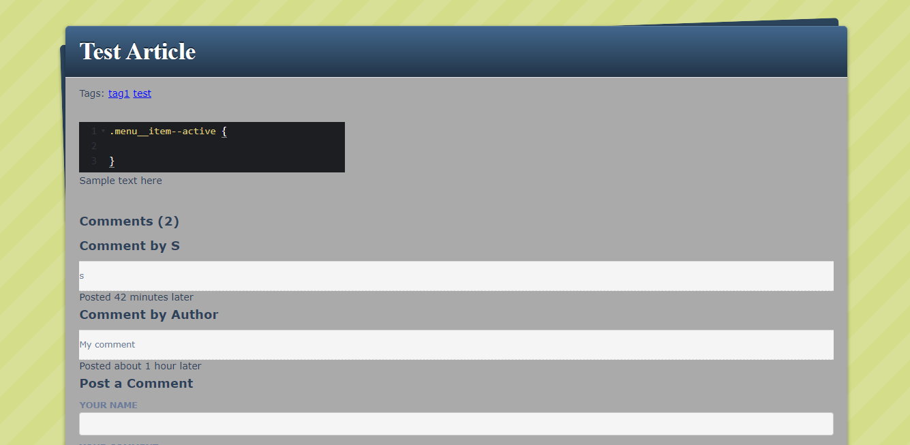

# Blogger - Rails project

> This is a basic blog created with Ruby on Rails to practice the workflow for setting up an application following MVC.

## Built With

- Ruby 2.5.1
- Rails 6.0.2.2
- Paperclip gem for image uploads

## Live Demo

[Live Demo Link](https://afternoon-atoll-92628.herokuapp.com)

## Authors

👤 **Sebastian Gil Rodriguez**

- Github: [@sebGilR](https://github.com/sebGilR)
- Twitter: [@sebGilR](https://twitter.com/sebGilR)
- Linkedin: [linkedin](https://www.linkedin.com/in/sebastiangilrodriguez)

👤 **Xochitl Selene Flores Perez**

- Github: [@enelesmai](https://github.com/enelesmai)
- Twitter: [@enelesmai](https://twitter.com/enelesmai)
- Linkedin: [xochitlselene](https://www.linkedin.com/in/xochitlselene)

## 🤝 Contributing

Contributions, issues and feature requests are welcome!

Feel free to check the [issues page](https://github.com/sebGilR/blogger_rails/issues).

## Show your support

Give a ⭐️ if you like this project!
